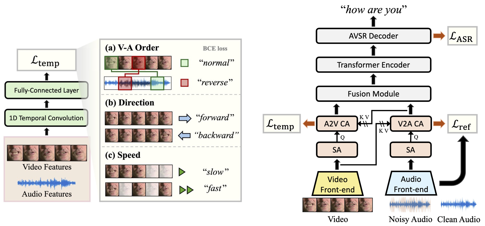
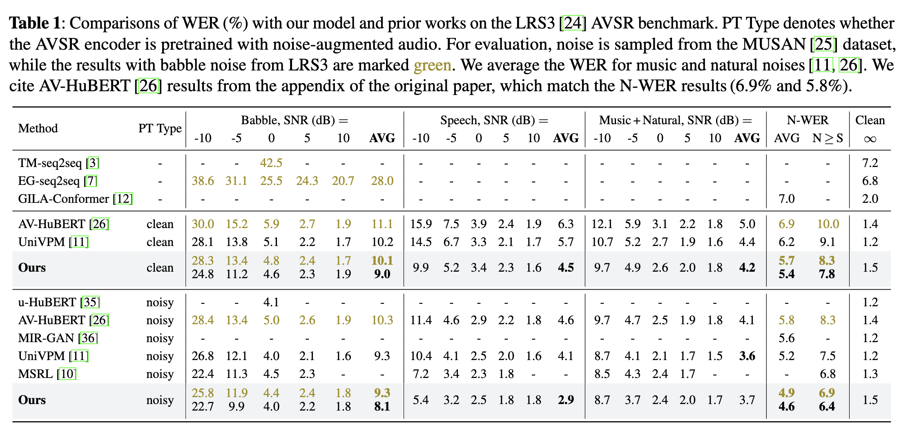

# Video Temporal Dynamics for Robust AVSR (SLT 2024)

<a href='https://arxiv.org/abs/2407.03563'></a>  <a href=#bibtex></a> 


<br>

<p align="center">

</p>

**Learning Video Temporal Dynamics with Cross-Modal Attention for Robust Audio-Visual Speech Recognition**, SLT 2024.

[Sungnyun Kim](https://bit.ly/sungnyunkim)\*,
[Kangwook Jang](https://scholar.google.com/citations?user=p8GFX-sAAAAJ&hl)\*,
[Sangmin Bae](https://www.raymin0223.com/),
[Hoirin Kim](https://scholar.google.com/citations?user=naLHjOsAAAAJ&hl=en),
[Se-Young Yun](https://fbsqkd.github.io)<br/>
\* equal contribution

## Introduction

Audio-visual speech recognition (AVSR) aims to transcribe human speech using both audio and video modalities. Although video information becomes particularly crucial in environments with noise-corrupted audio, prior works have primarily focused on enhancing audio features in AVSR, overlooking the importance of video features. In this study, we strengthen the video features by learning the temporal dynamics in video data. Cross-modal attention modules are introduced to enrich video features with audio information so that speech variability can be taken into account when training on the video temporal dynamics. 

- **Video temporal dynamics learning** enahnces the video features for AVSR, thereby significantly improving robustness in noisy audio conditions.
-  To this end, we design **cross-modal attention modules** for enhancing the correlation between video and audio features.
- Our temporal dynamics learning includes self-supervised tasks, predicting the context order between audio and video frames, the playback direction, and the playback speed of video frames.
- **Robust AVSR performance**: Evaluating on the LRS2 and LRS3 AVSR benchmarks with the MUSAN
noise, our method achieves the SOTA N-WER on both benchmarks (5.9% on LRS2 and 4.6% on LRS3). 

## BibTex

If you find this repo useful for your research, please consider citing our paper.
```BibTeX
@article{kim2024learning,
  title={Learning Video Temporal Dynamics with Cross-Modal Attention for Robust Audio-Visual Speech Recognition},
  author={Kim, Sungnyun and Jang, Kangwook and Bae, Sangmin and Kim, Hoirin and Yun, Se-Young},
  journal={arXiv preprint arXiv:2407.03563},
  year={2024}
}
```

# How to use

This repository is mainly built upon the [facebookresearch/av_hubert](https://github.com/facebookresearch/av_hubert) repo. Please follow the first few steps for setup.

## Installation
First, create a conda virtual environment and activate it:
```
conda create -n avhubert python=3.8 -y
conda activate avhubert
```
Then, clone this directory:
```
git clone https://github.com/sungnyun/avsr-temporal-dynamics.git
cd avhubert
git submodule init
git submodule update
```

Lastly, install `fairseq` and the other packages:
```
pip install -r requirements.txt
cd fairseq
pip install --editable ./
```

If hydra or omegaconf makes errors, try to change their versions.


## Train an AVSR model with Temporal Dynamics Learning

### Requirements
Follow the steps for [data preparation](https://github.com/facebookresearch/av_hubert?tab=readme-ov-file#data-preparation) process and [pretraining](https://github.com/facebookresearch/av_hubert?tab=readme-ov-file#pre-train-an-av-hubert-model) an AV-HuBERT model (you can simply use the [pretrained checkpoints](http://facebookresearch.github.io/av_hubert)).

- Prepare the LRS3 audio-video and MUSAN noise datasets.
- For the pretrained checkpoint, download `Noise-Augmented AV-HuBERT Large` model and place it under `/path/to/checkpoints`.

### Finetune model
Make sure that `{train,valid}.tsv` and `{train,valid}.wrd` are saved at `/path/to/LRS3/433h_data`, and the configuration file is saved at `/path/to/conf/conf-name`.

To fine-tune a pre-trained AV-HuBERT model at `/path/to/checkpoints`, run:
```sh
$ cd avhubert
$ fairseq-hydra-train --config-dir /path/to/conf/ --config-name conf-name \
  task.data=/path/to/LRS3/433h_data task.label_dir=/path/to/LRS3/433h_data \
  task.tokenizer_bpe_model=/path/to/LRS3/spm1000/spm_unigram1000.model \
  task.noise_wav=/path/to/musan/tsv/all/ \
  model.w2v_path=/path/to/checkpoints/large_vox_iter5.pt \
  hydra.run.dir=/path/to/experiment/finetune/ common.user_dir=`pwd`
```

For the implementation of the temporal predictor modules, refer to `avhubert/xmodal_temporal_modules.py`.
Some important parameters regarding the temporal dynamics learning tasks include:
- `temporal_flow`: whether to use video-to-video order temporal order loss (default: `False`)
- `temporal_va_flow`: whether to use video-to-audio order temporal order loss (default: `True`)
- `temporal_direction`: whether to use temporal direction loss (default: `True`)
- `temporal_speed`: whether to use temporal speed loss (default: `True`)
- `temp_hidden_dim`: hidden dimension for temporal predictor modules
- `aggregator_kernel_size`: kernel size of the 1D temporal convolution layer in the predictor (default: `3`)
- `xmodal_layers`: number of cross-modal attention layers for each streamline (default: `2` as SA-CA layers specified by `xmodal_layers_type`)
- `xmodal_embed_dim`: cross-modal attention embedding dimension

### Decoding
Suppose the `test.tsv` and `test.wrd` are the video list and transcripts of
the split to be decoded, saved at `/path/to/LRS3/433h_data`, and the fine-tuned model is
saved at `/path/to/experiment/finetune/checkpoints`.

Decoding results will be saved at
`/path/to/experiment/decode/s2s/test`.

```sh
$ cd avhubert
$ python -B infer_s2s.py --config-dir ./conf/ --config-name s2s_decode \
  dataset.gen_subset=test common_eval.path=/path/to/experiment/finetune/checkpoints/checkpoint_best.pt \
  override.noise_wav=/path/to/noise override.noise_prob=1 override.noise_snr={snr} \
  common_eval.results_path=/path/to/experiment/decode/s2s/test \
  common.user_dir=`pwd`
```

`{snr}` is the signal-to-noise ratio (SNR) and `/path/to/noise` is a folder containing noise manifest files (`/path/to/noise/{valid,test}.tsv`). See [`preparation`](avhubert/preparation/) for setting up this folder.

## LRS3 Robust AVSR Result

<p align="center">

</p>


## Contact
For any details or clarification, please reach out to
- Sungnyun Kim: ksn4397@kaist.ac.kr
- Kangwook Jang: dnrrkdwkd12@kaist.ac.kr
